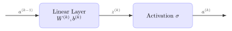

<!-- Load Mermaid.js -->

*A Mathematical Derivation and Implementation Notes*

## **1. Introduction**
Backpropagation is the cornerstone algorithm for training neural networks.
It efficiently computes gradients of the loss function with respect to each weight by applying the chain rule of calculus.
This document derives the math step-by-step and links it to the implementation in this project.

### **Notation**
* $\mathcal{L}$: Loss function (e.g., MSE, Cross-Entropy).
* $a^{(k)}$: Activation at layer $k$ (e.g., $a^{(k)} = ReLU(z^{(k)})$).
* $y$: True label, $a^{(L)}$: Predicted output.
* $W^{(k)}$: Weight matrix for layer $k$.
* $b^{(k)}$: Bias vector for layer $k$.
* $z^{(k)}$: Pre-activation at layer $k$ ($z^{(k)} = W^{(k)}a^{(k-1)} + b^{(k)}$).
* $\sigma$: Activation function (e.g., ReLU, Sigmoid).
* $\odot$: Element-wise (Hadamard) product.

We will be using standard theoretical dimensions for the tensors:
* $a^{(k)} \in \mathbb{R}^{n \times 1}$
* $W^{(k)} \in \mathbb{R}^{m \times n}$
* $b^{(k)} \in \mathbb{R}^{m \times 1}$

## **2. Derivation of Backpropagation**
### **Forward Pass**

  <figure style="margin: 0;">
    
    <figcaption style="text-align: center;">
  <figcaption>Forward Pass through Neural Network Layer</figcaption>
</figcaption>
  </figure>

  

$$
\begin{aligned}
z^{(k)} &= W^{(k)}a^{(k-1)} + b^{(k)} \\
a^{(k)} &= \sigma(z^{(k)})
\end{aligned}
$$

### **Backward Pass**

Let
